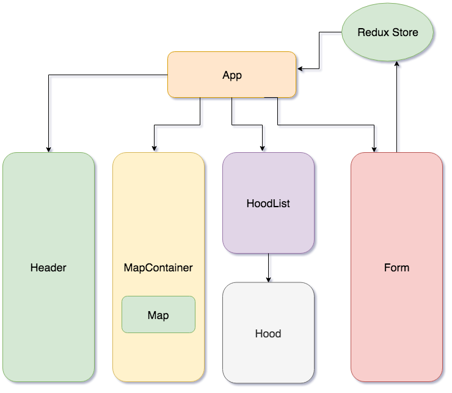

# **Belong**
#####  Capstone Project at Epicodus, 03/01/2019
##### Tanvi Garg   

## Description
A web application that helps you move into any new area by showing you information about nearby neighborhoods so you can see how well they suit your style.

## Table of Contents
  1. [MVP](#specs-work)
  2. [Further Exploration](#specs-work1)
  3. [Component Tree and Data Flow](#plan)
  4. [Setup on OSX](#setup)
  5. [Technologies Used](#Tech-used)
  7. [MIT License](#mit-lic)

## User Stories for Minimum Viable Product 
##### Getting Started and Searching

* Type in a specific address or a general region that you would like to be close to
* This displays a list of nearby neighborhoods. Each neighborhood is shown with the price ranges to live there, as well as the commute distance and travel time to the address provided.

## User Stories -  Further Exploration 

##### Filtering the Search Results By clicking on the Filter Options button, you can filter the search results by the following criteria:

* Price

##### Exploring a Neighborhood's Details

* In the details view you can see a stream of nearby Instagram photos
* Amenities will display nearby: libraries, stores, restaurants, schools...
* Attractions will display nearby: museums, night clubs, stadiums...

##### Statistics from detail

* The pie chart with the Resident Age Distribution
* The bar chart showing how the neighborhood compares with the nation for percentage of: homes with kids property owners vs. renters single residents

## Component Tree and Data Flow

## Setup 
* Install Node.js
* Clone this project with `git clone https://github.com/TanviCodeLife/Belong`
* Navigate to the root directory of the project with `cd Belong`
* Create a `.env` file in the root of the directory
* Run npm install to install dependencies
* Run npm run start to build and serve the project
* View the project in any browser at `http://localhost:8080/`

## Technology Used 

* React
* Redux
* Styled Components
* Jest Test Suite
* [Google Geocoding API](https://developers.google.com/maps/documentation/geocoding/intro)
* [Google Distance Matrix API](https://developers.google.com/maps/documentation/distance-matrix/start)
* [Google Javascript Maps API](https://developers.google.com/maps/documentation/javascript/tutorial)
* [Google Places API](https://developers.google.com/places/web-service/intro)
* [Icon](https://www.iconfinder.com/icons/2657712/home_location_house_map_pin_house_pointer_map_pointer_house_residential_place_icon)

## Support and contact details

Tanvi Garg: [tanvi.garg23@gmail.com](mailto:tanvi.garg23@gmail.com)

## License 

This software is licensed under the MIT license.

Copyright (c) 2018 **Tanvi Garg**
